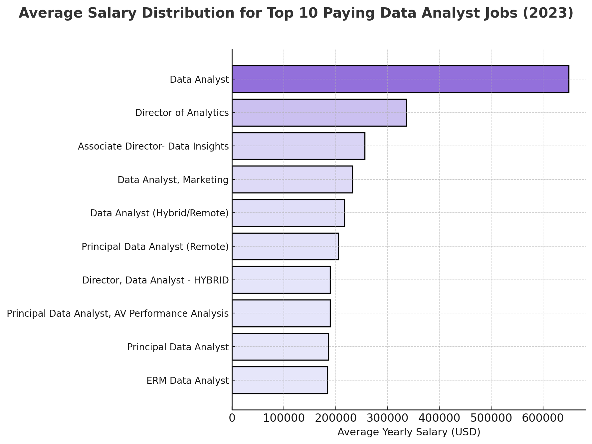
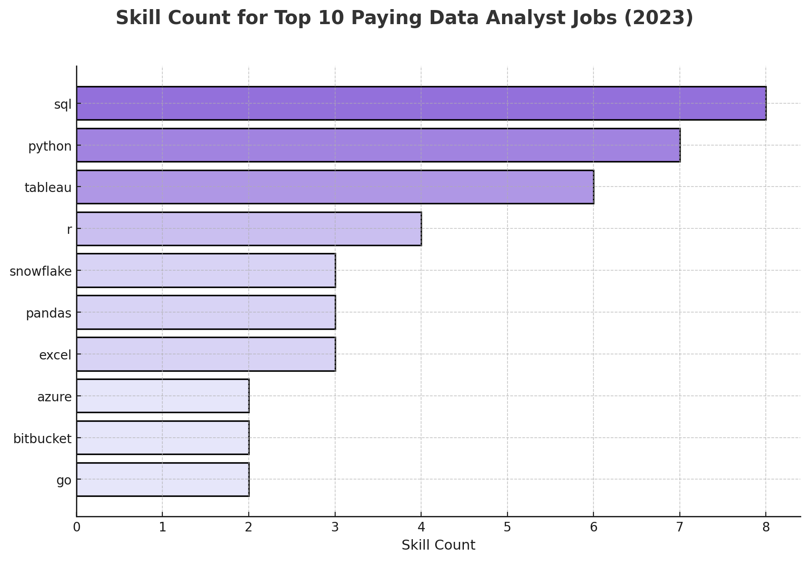

# Introduction
The world of data jobs is changing fast, and there’s a lot more to it than just crunching numbers. In this project, I wanted to take a closer look at what’s really happening in the data job market which roles pay the most, what skills are in demand, and which ones are actually worth learning if you want to stand out (and get paid well).

You can check them out in the SQL queries here: [project_sql folder](/project_sql/)

I explored things like the top-paying jobs, skills tied to higher salaries, and trends that show how tools like Python, cloud tech, and machine learning are shaping what employers look for. The goal’s simple — to figure out which skills give you the best mix of opportunity, demand, and income in today’s data-driven world.

# Background
The demand for data professionals keeps growing as companies rely more on data to make decisions. Roles like data analyst, data scientist, and data engineer are in high demand, but each requires different skills and tools. With so many options, from Python and SQL to cloud platforms and machine learning, it can be hard to know which ones matter most.

This project looks at the current data job market to find out which skills are most in demand, which ones lead to higher salaries, and what combination of skills gives the best chance for success in the data field.

The dataset I used is from my [SQL Course](https://lukebarousse.com/sql). It’s packed with useful info on data jobs including titles, salaries, locations, and important skills.

### The question I wanted to answer through my SQL queries were:
1. What are the top-paying data analyst jobs?
2. What are the skills required for these top-paying jobs?
3. What are the most in-demand skills for data analyst?
4. What are the top skills based on salary for data analyst?
5. What are the most optimal skills to learn?

# Tools I Used
For this project, I worked with a few tools that made the analysis and workflow smoother:

- **SQL**: used for exploring and analyzing the dataset, running queries, and uncovering insights.

- **PostgreSQL**: served as the main database system to store and manage all the data efficiently.

- **Visual Studio Code**: my go-to editor for writing SQL queries and managing project files.

- **Git & GitHub**: used for version control and keeping track of changes while sharing my work online.

# The Analysis
This project explores five key areas of the data job market to understand what drives pay and demand in data roles.

### 1. Top Paying Data Analyst Jobs
I started by identifying which data analyst positions offer the highest salaries. This helps show where the biggest earning potential lies within the field.

```sql
SELECT
    job_id,
    job_title,
    job_location,
    job_schedule_type,
    salary_year_avg,
    job_posted_date,
    name AS company_name
FROM
    job_postings_fact
LEFT JOIN company_dim ON job_postings_fact.company_id = company_dim.company_id
WHERE
    job_title_short = 'Data Analyst' AND
    job_location = 'Anywhere' AND
    salary_year_avg IS NOT NULL
ORDER BY
    salary_year_avg DESC
LIMIT 10
```

- The “Data Analyst” role at Mantys leads with an exceptionally high salary of $650,000, far above the rest.

- Executive and senior positions such as “Director of Analytics” (Meta) and “Associate Director – Data Insights” (AT&T) follow, earning between $250K–$330K.

- Specialized analyst roles like “Principal Data Analyst” or “Marketing Data Analyst” still command impressive pay, mostly within the $180K–$230K range.



*Bar graph visualizing the salary for the top 10 salaries for data analysts; ChatGPT generated this graph from my SQL query results*

### 2. Skills for Top Paying Jobs
Next, I looked into what skills appear most often in those high-paying roles — tools and technologies that employers value the most.

```sql
WITH top_paying_jobs AS (
    SELECT
        job_id,
        job_title,
        salary_year_avg,
        name AS company_name
    FROM
        job_postings_fact
    LEFT JOIN company_dim ON job_postings_fact.company_id = company_dim.company_id
    WHERE
        job_title_short = 'Data Analyst' AND
        job_location = 'Anywhere' AND
        salary_year_avg IS NOT NULL
    ORDER BY
        salary_year_avg DESC
    LIMIT 10
)

SELECT
    top_paying_jobs.*,
    skills
FROM top_paying_jobs
INNER JOIN skills_job_dim ON top_paying_jobs.job_id = skills_job_dim.job_id
INNER JOIN skills_dim ON skills_job_dim.skill_id = skills_dim.skill_id
ORDER BY
    salary_year_avg DESC
```

Here's the breakdown of the most demanded skills for data analysts in 2023, based on job postings:
- SQL is leading with a bold count of 8.
- Python follows closely with a bold count of 7.
- Tableau is also highly sought after, with a bold count of 6.
Other skills like R, Snowflake, Pandas, and Excel show varying degrees of demand.



*Bar graph visualizing the count of skills for the top 10 paying jobs for data analysts; ChatGPT generated this graph from my SQL query results*

### 3. In-Demand Skills for Data Analysts
This part focuses on which skills are currently most requested in job listings, showing what’s trending and what companies are actively hiring for.

```sql
SELECT
    skills,
    COUNT(skills_job_dim.job_id) AS demand_count
FROM job_postings_fact
INNER JOIN skills_job_dim ON job_postings_fact.job_id = skills_job_dim.job_id
INNER JOIN skills_dim ON skills_job_dim.skill_id = skills_dim.skill_id
WHERE
    job_title_short = 'Data Analyst' AND
    job_work_from_home = True
GROUP BY
    skills
ORDER BY
    demand_count DESC
LIMIT 5
```

- **SQL** leads by a wide margin with **7,291 job listings**, showing that it remains the **core skill** every data analyst needs.

- **Excel** follows with **4,611 mentions**, proving that despite newer tools, it’s still widely used for quick analysis and reporting.

- **Python** ranks third **(4,330 listings)** and is crucial for advanced analytics, automation, and data modeling.

- Visualization tools like **Tableau (3,745)** and **Power BI (2,609)** highlight the growing importance of **data storytelling** and **business communication skills** in analytics roles.

| Skill      | Demand Count |
|------------|--------------|
| SQL        | 7,291        |
| Excel      | 4,611        |
| Python     | 4,330        |
| Tableau    | 3,745        |
| Power BI   | 2,609        |

*Table of the demand for the top 5 skills in data analyst job postings*

### 4. Skills Based on Salary
Here, I compared skills to average salaries to see which ones lead to higher pay — basically finding the link between what you know and what you earn.

```sql
SELECT
    skills,
    ROUND(AVG(salary_year_avg), 0) AS avg_salary
FROM job_postings_fact
INNER JOIN skills_job_dim ON job_postings_fact.job_id = skills_job_dim.job_id
INNER JOIN skills_dim ON skills_job_dim.skill_id = skills_dim.skill_id
WHERE
    job_title_short = 'Data Analyst'
    AND salary_year_avg IS NOT NULL
    AND job_work_from_home = True
GROUP BY
    skills
ORDER BY
    avg_salary DESC
LIMIT 25
```

Here are 3 concise insights into what the top-paying data analyst roles tend to consist of - based on the salary data
- Data Engineering–Driven Analysts: High-paying roles are moving beyond dashboards — they involve building scalable data pipelines and handling big data frameworks.
- Hybrid Analyst–Engineer Skill Sets: Top salaries go to analysts who combine programming, DevOps, and automation abilities.
- AI-Enhanced & Cloud-Native Analytics: The presence of Watson, DataRobot, scikit-learn, and GCP signals that the highest-paying analysts are those leveraging machine learning and cloud platforms to deliver predictive insights and scalable solutions - not just static reporting.

| Skill         | Average Salary (USD) |
|---------------|----------------------|
| PySpark       | 208,172              |
| Bitbucket     | 189,155              |
| Couchbase     | 160,515              |
| Watson        | 160,515              |
| DataRobot     | 155,486              |
| GitLab        | 154,500              |
| Swift         | 153,750              |
| Jupyter       | 152,777              |
| Pandas        | 151,821              |
| Elasticsearch | 145,000              |

*Table of the average salary for the top 10 paying skills for data analysts*

### 5. Most Optimal Skills to Learn
Finally, I pulled everything together to highlight the best mix of high-paying and in-demand skills — the ones that are smart to focus on for career growth.

```sql
WITH skills_demand AS (
    SELECT
        skills_dim.skill_id,
        skills_dim.skills,
        COUNT(skills_job_dim.job_id) AS demand_count
    FROM job_postings_fact
    INNER JOIN skills_job_dim ON job_postings_fact.job_id = skills_job_dim.job_id
    INNER JOIN skills_dim ON skills_job_dim.skill_id = skills_dim.skill_id
    WHERE
        job_title_short = 'Data Analyst'
        AND salary_year_avg IS NOT NULL
        AND job_work_from_home = True
    GROUP BY
        skills_dim.skill_id
), average_salary AS (
    SELECT
        skills_job_dim.skill_id,
        ROUND(AVG(job_postings_fact.salary_year_avg), 0) AS avg_salary
    FROM job_postings_fact
    INNER JOIN skills_job_dim ON job_postings_fact.job_id = skills_job_dim.job_id
    INNER JOIN skills_dim ON skills_job_dim.skill_id = skills_dim.skill_id
    WHERE
        job_title_short = 'Data Analyst'
        AND salary_year_avg IS NOT NULL
        AND job_work_from_home = True
    GROUP BY
        skills_job_dim.skill_id
)

SELECT
    skills_demand.skill_id,
    skills_demand.skills,
    demand_count,
    avg_salary
FROM
    skills_demand
INNER JOIN average_salary ON skills_demand.skill_id = average_salary.skill_id
WHERE
    demand_count > 10
ORDER BY
    avg_salary DESC,
    demand_count DESC
LIMIT 25;
```

The analysis identifies the top 10 most optimal skills for data analysts based on both salary and demand. These skills strike the best balance between earning potential and market relevance.

- **Go (Golang)** tops the list with the highest average salary of $115,320, showing strong demand for data analysts with programming and backend integration skills.

- Tools like **Confluence** and **Hadoop** follow closely, reflecting the value of **data infrastructure** and **project collaboration** experience.

- **Snowflake**, **Azure**, and **BigQuery** highlight the **growing demand for cloud-based data solutions**, emphasizing the importance of cloud analytics expertise.

- Popular platforms such as **AWS**, **Java**, and **SSIS** remain valuable for those working with enterprise-level data pipelines.

- Overall, combining programming (Go, Java), data systems (Hadoop, Snowflake, SSIS), and cloud tools (Azure, AWS) offers strong potential for both salary and job opportunities.

| Skill ID  | Skill       | Demand Count  | Average Salary (USD) |
|-----------|-------------|---------------|----------------------|
| 8         | Go          | 27            | 115,320              |
| 234       | Confluence  | 11            | 114,210              |
| 97        | Hadoop      | 22            | 113,193              |
| 80        | Snowflake   | 37            | 112,948              |
| 74        | Azure       | 34            | 111,225              |
| 77        | BigQuery    | 13            | 109,654              |
| 76        | AWS         | 32            | 108,317              |
| 4         | Java        | 17            | 106,906              |
| 194       | SSIS        | 12            | 106,683              |
| 233       | Jira        | 20            | 104,918              |

*Table of the most optimal skills for data analyst sorted by salary*

# What I Learned
Throughout this project, I learned how to work with data in a more advanced and structured way. 

I practiced writing **complex SQL queries** using functions and clauses like  
**`WITH`**, **`GROUP BY`**, **`COUNT()`**, and **`AVG()`** to organize, summarize, and analyze data effectively.  

I also developed a stronger understanding of **data aggregation** learning how to combine and interpret large datasets to reveal key insights.

Beyond technical skills, this project helped sharpen my **analytical thinking**, especially in identifying patterns, comparing trends, and connecting results to real-world insights about the data job market.

# Conclusions
### Insights
From the analysis, it’s clear that the **data job market** continues to evolve rapidly, blending technical, analytical, and cloud-based skills.

- **SQL**, **Python**, and **Excel** remain the most in-demand and foundational skills for data analysts.  
- High-paying roles often require experience with **big data tools** like **PySpark**, **Databricks**, and **Snowflake**, as well as knowledge of **cloud platforms** such as **AWS**, **Azure**, and **GCP**.  
- The strongest professionals combine **data manipulation**, **engineering**, and **visualization** skills, enabling them to turn raw data into meaningful business insights.  

Overall, success in this field comes from balancing **technical mastery** with **strategic analytical thinking**.

### Closing Thoughts
This project gave me hands-on experience in exploring real job market data and understanding how each skill contributes to both **salary growth** and **career opportunities**.

I realized that being a great data analyst isn’t just about knowing tools, it’s about knowing **how to use them to create impact**.  

Moving forward, I plan to keep improving my SQL and Python skills, explore more **cloud technologies**, and continue building projects that help me apply data analysis to solve real-world problems.
